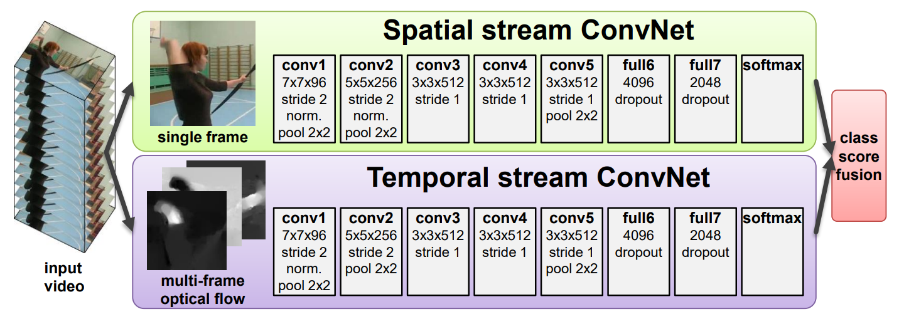
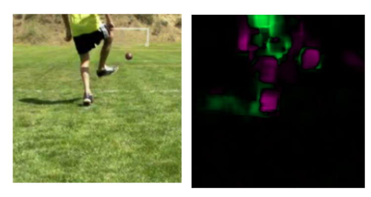
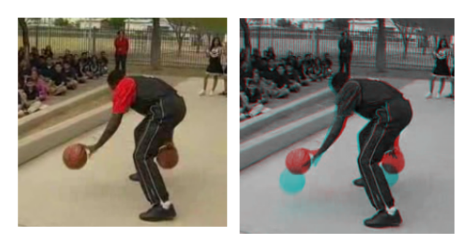
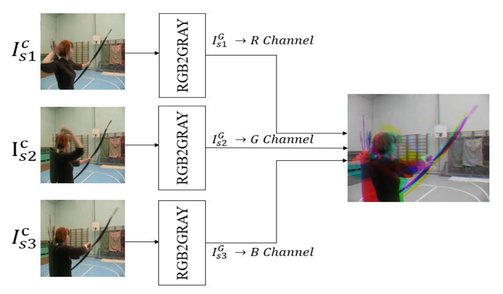
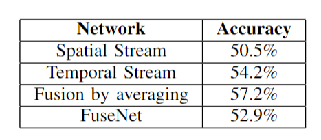

# Two-Stream Human Action Classification

## Summary

This project aims to classify human action in videos found in the HMDB-51 dataset (containing scenes from movies and YouTube). A two-stream convolutional neural network architecture with pre-trained back-bones (ResNet-50) and late fusion to capture spatial and temporal information. Our experiments vary the dataset format, input features, and fusion strategy to yield promising results that in some cases outperform past methods.

This project was done as part of "CIS 680: Vision and Learning" with partners Akhil Devarakonda and Rahul Zahroof.
[Link to the report.](Report.pdf)

The paper "Two-stream convolutional networks for action recognition in videos" by Simonyan et al. was used as inspiration for the two-stream approach:

   

The temporal input feature has more room for fexibility of approach. The two main classes of input used here were optical flow and stacked grayscale 3-channel image (SG3I):

Optical Flow   |  SG3I
:-------------------------:|:-------------------------:
   |   | 

We found better results with SG3I. The following diagram illustrates the creation of this input as seen in "Action Recognition in Videos Using Pre-Trained 2D Convolutional Neural Networks" by J. Kim et al.:

   

The final validation results on HMDB-51 are shown here. Network-based late fusion surprisingly underperformed a simple average between the two streams. In the future we would like to try alternative fusion methods that share information between the streams at various network depths.

   

## Instructions for Training and Testing
Run the following files to train spatial, temporal, and fuseNet on the full dataset. The code blocks have titles which explain their function.
- Spatial_Stream_Full.ipynb
- Temporal_Stream_Full.ipynb
- FuseNet_Full.ipynb

Run the following files to train spatial, temporal, and fuseNet on the sampled dataset. The code blocks have titles which explain their function.
- Spatial_Stream_Sampled.ipynb
- Temporal_Stream_Sampled.ipynb
- FuseNet_Sampled.ipynb

## Datasets
View "dataset_curation.md" to find instructions for setting up the datasets.

### Full Dataset - Mode 1
Data sampled by every consecutive frame, without defining a set framerate or skipping frames.

### Sampled Dataset - Mode 2
Data sampled at 6 fps, skipping 1 second between frames

## Plotting Model Performance
Any model's performance (training loss, validation loss, accuracy) can be plotted using the plotting.py function. Make sure to update the path to model. The plotting code block at the end of each notebook file can also be used instead.

## Models
All necessary models can be found in this gdrive link: https://drive.google.com/drive/folders/1jeQpvKQttygRkUPmZcLOl1YYjefw0CH3?usp=sharing